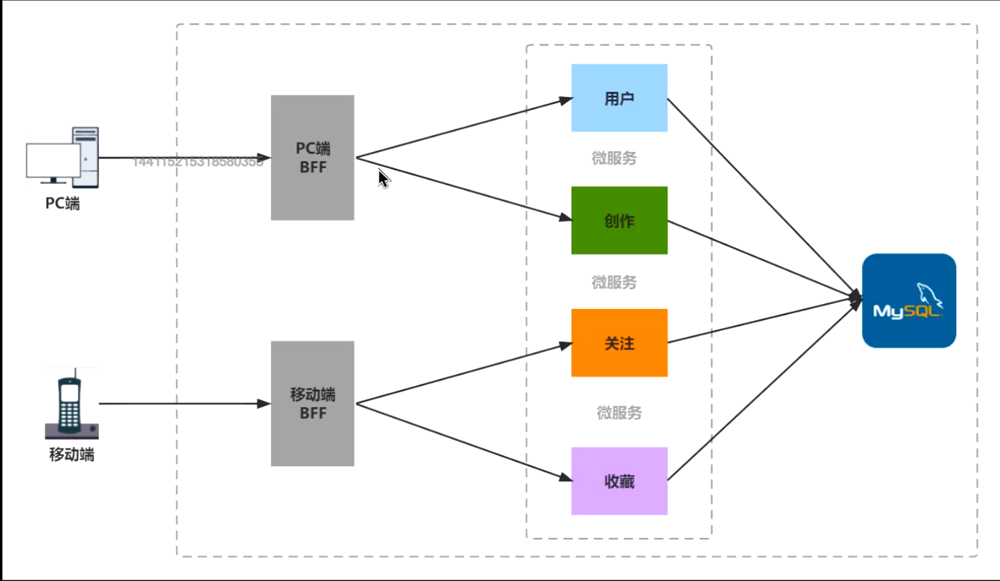
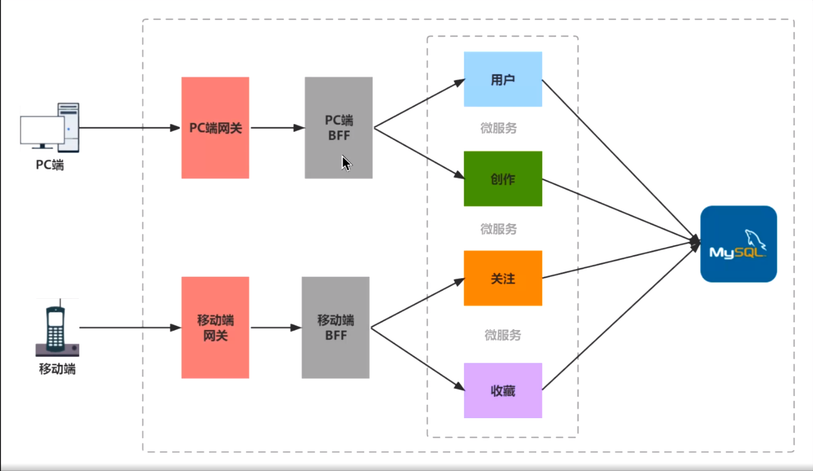
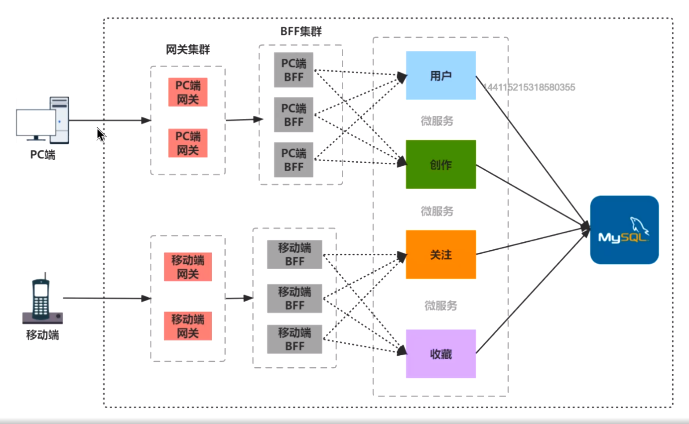

## 大纲

- BFF 架构演进
- RPC 高性能 BFF 实战
- DDD、GraphQL 实战 BFF
- Serverless 实战 BFF

### 微服务

优点：将单体应用划分为更小的服务，每个服务可以独立运行并且可以使用不同的语言开发，这些服务可能放在不同的机器上，他们之间的通信协议使用 RPC，该协议比 HTTP 具有更低的延迟和更高的性能

缺点：

- 域名开销增加
- 内部服务器暴露在公网，有安全隐患
- 各个端有大量的个性化需求
  - 数据聚合 某些功能可能需要调用多个微服务进行组合
  - 数据裁剪 后端服务返回的数据可能需要过滤掉一些敏感数据
  - 数据适配 后端返回的数据可能需要针对不同端进行数据结构的适配，后端返回 XML ，但 前端需要 JSON
  - 数据鉴权 不同的客户端有不同的权限要求

### BFF

BFF 是 Backend for Frontend 的缩写，指的是专门为前端应用设计的后端服务 主要用来为各个端提供代理数据聚合、裁剪、适配和鉴权服务，方便各个端接入后端服务 BFF 可以把前端和微服务进行解耦，各自可以独立演进

### 网关

- API 网关是一种用于在应用程序和 API 之间提供安全访问的中间层
- API 网关还可以用于监控 API 调用，路由请求，以及在请求和响应之间添加附加功能（例如身份验
  证，缓存，数据转换，压缩、流量控制、限流熔断、防爬虫等）
- 网关和 BFF 可能合二为一

### 集群化

单点服务器可能会存在以下几个问题：

- 单点故障：单点服务器只有一台，如果这台服务器出现故障，整个系统都会停止工作，这会导
  致服务中断
- 计算能力有限：单点服务器的计算能力是有限的，无法应对大规模的计算需求
- 可扩展性差：单点服务器的扩展能力有限，如果想要提升计算能力，就必须改造或者替换现有
  的服务器
  这些问题可以通过采用服务器集群的方式来解决
  

### RPC

`RPC（Remote Procedure Call）` 是远程过程调用的缩写，是一种通信协议，允许程序在不同的 计算机上相互调用远程过程，就像调用本地过程一样

### sofa-rpc-node 框架

`sofa-rpc-node` 是(阿里开源)基于 Node.js 的一个 RPC 框架，支持多种协议

### Protocol Buffers

`Protocol Buffers （简称 protobuf）`是 Google 开发的一种数据序列化格式，可以将结构化数 据序列化成二进制格式，并能够跨语言使用

### Zookeeper

ZooKeeper 是一个分布式协调服务，提供了一些简单的分布式服务，如配置维护、名字服务、组服务等。它可以用于管理分布式系统中的数据

### 缓存

一般会使用多级缓存，本地做一层 LRU 缓存，再做一层远程服务器的 Redis 缓存。这些缓存层的优先级通常是依次递减的，即最快的缓存层位于最顶层，最慢的缓存层位于最底层。越上层的缓存缓存时间一般越短

### 消息队列

在 BFF 中使用消息队列（message queue）有几个原因：

- 大并发：消息队列可以帮助应对大并发的请求，BFF 可以将请求写入消息队列，然后后端服务 可以从消息队列中读取请求并处理 
- 解耦：消息队列可以帮助解耦 BFF 和后端服务，BFF 不需要关心后端服务的具体实现，只需 要将请求写入消息队列，后端服务负责从消息队列中读取请求并处理 
- 异步：消息队列可以帮助实现异步调用，BFF 可以将请求写入消息队列，然后立即返回响应给 前端应用，后端服务在后台处理请求 
- 流量削峰：消息队列可以帮助流量削峰，BFF 可以将请求写入消息队列，然后后端服务可以在 合适的时候处理请求，从而缓解瞬时高峰流量带来的压力

### RabbitMQ

RabbitMQ 是一个消息代理，它可以用来在消息生产者和消息消费者之间传递消息 RabbitMQ的工作流程如下：

- 消息生产者将消息发送到 RabbitMQ 服务器 
- RabbitMQ 服务器将消息保存到队列中
- 消息消费者从队列中读取消息 
- 当消息消费者处理完消息后 RabbitMQ 服务器将消息删除

## 实战案例

todo

## BFF的问题

- 复杂性增加：添加 BFF 层会增加系统的复杂性，因为它需要在后端 API 和前端应用程序之间处理请 求和响应
- 性能问题：如果 BFF 层的实现不当，可能会导致性能问题，因为它需要在后端 API 和前端应用程序 之间传输大量数据 
- 安全风险：如果 BFF 层未得到正确保护，可能会导致安全风险，因为它可能会暴露敏感数据 维护成本：BFF 层需要维护和更新，这会增加维护成本 
- 测试复杂性：由于 BFF 层需要在后端 API 和前端应用程序之间进行测试，因此测试可能会变得更加 复杂 运维问题 要求有强大的日志、服务器监控、性能监控、负载均衡、备份冗灾、监控报警和弹性伸缩 扩容等

但是上述的问题可以使用 Serverless 来进行解决，特别是针对前端来说

