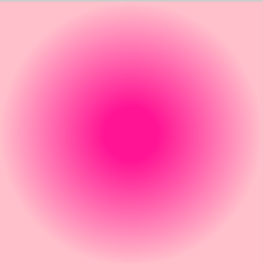

## Canvas 基础

### 渲染效果


### 示例基础代码

```html
<!DOCTYPE html>
<html lang="en">
  <head>
    <meta charset="UTF-8" />
    <meta http-equiv="X-UA-Compatible" content="IE=edge" />
    <meta name="viewport" content="width=device-width, initial-scale=1.0" />
    <title>Document</title>
    <style>
      * {
        padding: 0;
        margin: 0;
      }
    </style>
  </head>
  <body style="display: flex; flex-wrap: wrap">
    <!-- 不能通过css设置canvas宽高 -->
    <!-- 直线 -->
    <canvas
      id="line"
      width="300"
      height="300"
      style="border: 1px solid #ccc"
    ></canvas>

    <!-- 折线 -->
    <canvas
      id="brokenLine"
      width="300"
      height="300"
      style="border: 1px solid #ccc"
    ></canvas>

    <!-- 方形 -->
    <canvas
      id="rect"
      width="300"
      height="300"
      style="border: 1px solid #ccc"
    ></canvas>

    <!-- 多边形 -->
    <canvas
      id="polygon"
      width="300"
      height="300"
      style="border: 1px solid #ccc"
    ></canvas>

    <!-- 圆形 -->
    <canvas
      id="circle"
      width="300"
      height="300"
      style="border: 1px solid #ccc"
    ></canvas>

    <!-- 半圆 -->
    <canvas
      id="half-circle"
      width="300"
      height="300"
      style="border: 1px solid #ccc"
    ></canvas>

    <!-- 椭圆 -->
    <canvas
      id="ellipse"
      width="300"
      height="300"
      style="border: 1px solid #ccc"
    ></canvas>

    <!-- 弧线 -->
    <canvas
      id="arc"
      width="300"
      height="300"
      style="border: 1px solid #ccc"
    ></canvas>

    <!-- 文本 -->
    <canvas
      id="txt"
      width="300"
      height="300"
      style="border: 1px solid #ccc"
    ></canvas>

    <!-- 图片 -->
    <canvas
      id="img"
      width="300"
      height="300"
      style="border: 1px solid #ccc"
    ></canvas>

    <canvas
      id="img2"
      width="300"
      height="300"
      style="border: 1px solid #ccc"
    ></canvas>

    <!-- 运动动画 -->
    <canvas
      id="animation"
      width="300"
      height="300"
      style="border: 1px solid #ccc"
    ></canvas>
  </body>
  <script>
    function getCtx(cvsId) {
      const cvs = document.getElementById(cvsId);
      const ctx = cvs.getContext('2d');

      return { cvs, ctx };
    }
  </script>
</html>
```

### 直线

```js
(function line() {
  // 画直线
  const { ctx } = getCtx('line');

  // 起点坐标 x y
  ctx.moveTo(100, 100);
  // 终点坐标 x y
  ctx.lineTo(200, 100);

  // 修改线的宽度
  ctx.lineWidth = 20;
  // 修改直线的颜色
  ctx.strokeStyle = 'pink';
  // 修改直线两端样式
  ctx.lineCap = 'round'; // 默认: butt; 圆形: round; 方形: square
  // 连接起点和终点
  ctx.stroke();

  // 开辟第二条线的路径，让其不影响第一条线
  ctx.beginPath();
  ctx.moveTo(0, 0);
  ctx.lineTo(100, 100);
  ctx.lineWidth = 10;
  ctx.lineCap = 'round';
  ctx.strokeStyle = 'blue';
  ctx.stroke();
})();
```

### 折线

```js
// 画折线
(function brokenLine() {
  const { ctx } = getCtx('brokenLine');
  ctx.moveTo(0, 10);
  ctx.lineTo(100, 100);
  ctx.lineTo(200, 10);
  ctx.lineTo(300, 100);
  ctx.strokeStyle = 'skyBlue';
  ctx.lineWidth = 4;
  ctx.stroke();
})();
```

### 矩形

```js
// 用线段直接画矩形
(function rect() {
  const { ctx } = getCtx('rect');
  ctx.moveTo(10, 10);
  ctx.lineTo(100, 10);
  ctx.lineTo(100, 100);
  ctx.lineTo(10, 100);
  // ctx.lineTo(10, 10);
  // 和上面的方式等效
  ctx.closePath();
  ctx.lineWidth = 2;
  ctx.strokeStyle = 'pink';
  ctx.stroke();
})();

// 使用 strokeRect 画矩形
(function strokeRect() {
  const { ctx } = getCtx('rect');

  ctx.strokeStyle = 'deepPink';
  ctx.strokeRect(50, 50, 100, 100);

  // 使用 fillRect 来填充矩形
  ctx.fillStyle = 'yellow';
  ctx.fillRect(50, 50, 100, 100);
})();

// 使用 clearRect 清空指定区域
(function clear() {
  const { ctx, cvs } = getCtx('rect');
  setTimeout(() => {
    ctx.clearRect(50, 50, 50, 50);
  }, 2000);

  // 清空整个画布
  setTimeout(() => {
    ctx.clearRect(0, 0, cvs.width, cvs.height);
  }, 3000);
})();

// 画多边形
(function polygon() {
  const { ctx } = getCtx('polygon');

  ctx.moveTo(50, 50);
  ctx.lineTo(200, 50);
  ctx.lineTo(200, 200);
  // 手动闭合
  ctx.closePath();

  ctx.lineJoin = 'miter'; // 线条连接的样式。miter: 默认; bevel: 斜面; round: 圆角
  ctx.lineWidth = 10;
  ctx.stroke();
})();
```

### 圆形

```js
// 画个圆形
(function circle() {
  // arc(x, y, r, startAngle, endAngle，counterclockwise)
  // x,y 圆心坐标， r 半径，sAngle 开始角度（弧度制 Math.PI 表示 180°），eAngle 结束角度（弧度制），
  // counterclockwise 绘制方向 true 逆时针， false 顺时针，默认 false
  // 100° 应写成 100 * (Math.PI / 180)

  const { ctx } = getCtx('circle');
  ctx.beginPath();
  ctx.arc(150, 150, 50, 0, 360 * (Math.PI / 180));
  ctx.closePath();

  ctx.stroke();
})();
```

### 半圆

```js
// 画个半圆
(function halfCirle() {
  const { ctx } = getCtx('half-circle');

  ctx.beginPath();
  // 半圆在下方
  ctx.arc(150, 50, 50, 0, 180 * (Math.PI / 180));
  ctx.closePath();

  ctx.stroke();

  ctx.beginPath();
  // 半圆在上方，让方向变成逆时针
  ctx.arc(150, 150, 50, 0, 180 * (Math.PI / 180), true);
  ctx.closePath();

  ctx.stroke();
})();
```

### 椭圆

```js
// 画个椭圆
(function ellipse() {
  const { ctx } = getCtx('ellipse');
  // 圆心坐标x,y，x,y轴半径，椭圆旋转角度，开始绘制点，结束绘制点，时针方向
  // ellipse(x, y, radiusX, radiusY, rotation, startAngle, endAngle, anticlockwise)
  ctx.beginPath();
  ctx.ellipse(70, 80, 10, 30, 0, 0, 2 * Math.PI);
  ctx.stroke();

  ctx.beginPath();
  ctx.ellipse(220, 80, 10, 30, 0, 0, 2 * Math.PI);
  ctx.stroke();
  ctx.beginPath();

  ctx.ellipse(150, 130, 30, 10, 90 * (Math.PI / 180), 0, 2 * Math.PI); // 旋转90°
  ctx.fill();
})();
```

### 弧线

```js
// 画个弧线
(function halfCirle() {
  const { ctx } = getCtx('arc');

  ctx.beginPath();
  // 画个0到90度的弧线
  ctx.arc(150, 150, 50, 0, 90 * (Math.PI / 180));

  ctx.stroke();
})();
```

### 文本

```js
// 画文本，在绘制文字的时候，默认是以文字的左下角作为参考点进行绘制
(function txt() {
  const { ctx } = getCtx('txt');
  // 设置文字样式
  ctx.font = '60px 宋体';
  // 设置文本描边颜色
  ctx.strokeStyle = 'pink';
  // 超出 maxWidth 的部分将会被压缩
  // strokeText(text, x, y, maxWidth);
  ctx.strokeText('嘻嘻', 50, 100, 300);

  const haha = '哈哈';
  // 设置填充颜色
  ctx.fillStyle = 'deepPink';
  // 填充文本
  ctx.fillText(haha, 50, 200);

  // 获取文本的长度
  const txtLen = ctx.measureText(haha).width;
  ctx.font = '30px';
  ctx.fillText(`长度：${txtLen}`, 0, 260);

  // 文字水平对齐
  // textAlign = 'start 默认 | end | left | right | center'
  // 文字居中对齐
  // textBaseline = 'alphabetic 默认 | top | bottom | middle | hanging'
})();
```

### 图片

```js
// 渲染图片
(function img() {
  // 要渲染的图片，图片左上角横坐标和纵坐标
  // drawImage(image, dx, dy, dw, dh)
  const { ctx } = getCtx('img');
  const image = new Image();
  image.src = 'https://i.niupic.com/images/2022/12/17/ae22.png';
  // 可以通过网络去加载图片，也可以通过 dom 去获取
  // 比如 const img = document.getElementById("img");
  // 再把 img 渲染上去
  image.onload = () => {
    ctx.drawImage(image, 0, 0, 300, 300);
  };
})();

// 截取图片
(function cutImg() {
  const { ctx } = getCtx('img2');
  const image = new Image();
  image.src = 'https://i.niupic.com/images/2022/12/17/ae22.png';
  image.onload = () => {
    // 前面多了4个参数，截取的位置x,y和截取的宽高w,h
    ctx.drawImage(image, 50, 100, 100, 100, 0, 0, 300, 300);
  };
})();
```

### 小球运动动画

```js
(function animation() {
  const { ctx, cvs } = getCtx('animation');
  const ball = {
    x: 15,
    y: 15,
    radius: 15,
    // 横向加速度
    vx: 1,
    // 纵向加速度
    vy: 3,
    color: 'pink',
    draw: function () {
      ctx.beginPath();
      ctx.arc(this.x, this.y, this.radius, 0, 360 * (Math.PI / 180));
      ctx.closePath();
      ctx.fillStyle = this.color;
      ctx.fill();
    },
  };

  const draw = () => {
    ctx.clearRect(0, 0, cvs.width, cvs.height);
    ball.draw();
    // 添加加速度
    ball.vy *= 0.995;
    ball.vy += 0.25;

    // 添加速率
    ball.x += ball.vx;
    ball.y += ball.vy;

    // 添加边界
    if (
      ball.y + ball.vy > cvs.height - ball.radius ||
      ball.y + ball.vy < ball.radius
    ) {
      ball.vy = -ball.vy;
    }
    if (
      ball.x + ball.vx > cvs.width - ball.radius ||
      ball.x + ball.vx < ball.radius
    ) {
      ball.vx = -ball.vx;
    }

    if (ball.y > cvs.height - ball.radius) {
      return;
    }

    window.requestAnimationFrame(draw);
  };

  window.requestAnimationFrame(draw);
  ball.draw();
})();
```

### 基础样式 API

- 描边 stroke()
- lineWidth 默认值是 1 ，默认单位是 px。
- 使用 strokeStyle 设置线条颜色，strokeStyle = 颜色值
- lineCap = '属性值'，butt: 默认值，无线帽；square: 方形线帽；round: 圆形线帽
- 拐角样式 lineJoin，lineJoin = '属性值'。miter: 默认值，尖角；round: 圆角；bevel: 斜角
- 虚线 setLineDash()。setLineDash([])
- 填充 fill()
- 透明度 globalAlpha = 0-1 的数值
- 非零环绕填充。在使用 fill() 方法填充时，需要注意一个规则：非零环绕填充。在使用 moveTo 和 lineTo 描述图形时，如果是按顺时针绘制，计数器会加 1；如果是逆时针，计数器会减 1。当图形所处的位置，计数器的结果为 0 时，它就不会被填充。

## 渐变

### 线性渐变

`createLinearGradient(x1, y1, x2, y2)`

- x1, y1 为起点的坐标
- x2, y2 为终点的坐标

添加渐变色

`gradient.addColorStop(offset, color)`

- offset 颜色的偏移值，为 0 到 1 之间的数
- color 颜色


```js
(function gradient() {
  const { ctx } = getCtx('gradient');

  // 创建渐变
  const gradient = ctx.createLinearGradient(10, 10, 200, 10);
  gradient.addColorStop(0, 'pink');
  gradient.addColorStop(0.8, 'deepPink');

  ctx.fillStyle = gradient;
  ctx.fillRect(10, 10, 200, 100);
})();
```

### 径向渐变

`ctx.createRadialGradient(x0, y0, r0, x1, y1, r1)`
参数：

- x0, y0 为开始圆的坐标
- r0 为开始圆的半径
- x1, y1 为结束圆的坐标
- r1 为结束圆的半径



```js
(function radialGradient() {
  const { ctx } = getCtx('radialGradient');

  // 创建渐变
  const gradient = ctx.createRadialGradient(150, 150, 150, 150, 150, 0);
  gradient.addColorStop(0, 'pink');
  gradient.addColorStop(0.8, 'deepPink');

  ctx.fillStyle = gradient;
  ctx.fillRect(0, 0, 300, 300);
})();
```

## 贝塞尔曲线

一般用于画复杂的图形

### 二次贝塞尔曲线

[调试网站](http://blogs.sitepointstatic.com/examples/tech/canvas-curves/quadratic-curve.html)

有一个控制点

`quadraticCurveTo(cp1x, cp1y, x, y)`

参数：

- cp1x 和 cp1y 为控制点坐标
- x 和 y 为结束点坐标

### 三次贝塞尔曲线

[调试地址](http://blogs.sitepointstatic.com/examples/tech/canvas-curves/bezier-curve.html)

和二次贝塞尔曲线不同的是，它有两个控制点

`ctx.bezierCurveTo(cp1x,cp1y, cp2x,cp2y, x, y)`
参数：

- cp1x 和 cp1y 为第一个控制点坐标
- cp2x 和 cp2y 为第二个控制点坐标
- x 和 y 为结束点坐标

除此之外还有 3、4、5 次贝塞尔曲线...

## 动画

### 移动

让一个元素产生位移
`translate(x, y)`

- x 是左右偏移量
- y 是上下偏移量

### 旋转

让一个元素旋转

`rotate(angle)`
angle 是旋转的角度，以弧度为单位，顺时针旋转

### 缩放

把元素按一定的比例整体缩小或放大

`scale(x, y)`

- 水平缩放的值
- 垂直缩放的值

### 状态的保存和恢复

- ctx.save()
- ctx.restore()

## 变换

transform 不仅能实现移动、旋转和缩放，还能实现斜切。

`transform(a, b, c, d, e, f)`

默认参数为 transform(1, 0, 0, 1, 0, 0)

- a：水平缩放，不缩放为 1
- b：水平倾斜，不倾斜为 0
- c：垂直倾斜，不倾斜为 0
- d：垂直缩放，不缩放为 1
- e：水平移动，不移动为 0
- f：垂直移动，不移动为 0

### 移动

控制移动的参数是 e 和 f

```js
// x轴和y轴都移动了100
ctx.transform(1, 0, 0, 1, 100, 100);
```

### 缩放

控制缩放的参数是 a 和 d

```js
// x轴和y轴都放大1.5倍
ctx.transform(1.5, 0, 0, 1.5, 0, 0);
```

### 斜切

控制斜切的参数是 b 和 c

```js
// Y轴拉伸
ctx.transform(1, Math.PI / 20, 0, 1, 0, 0);
```

### 旋转

控制旋转的参数是 a、b、c 和 d

```js
// 旋转30度
const deg = 30 * (Math.PI / 180);

const cos = Math.cos(deg);
const sin = Math.sin(deg);

ctx.transform(cos, sin, -sin, cos, 0, 0);
```
